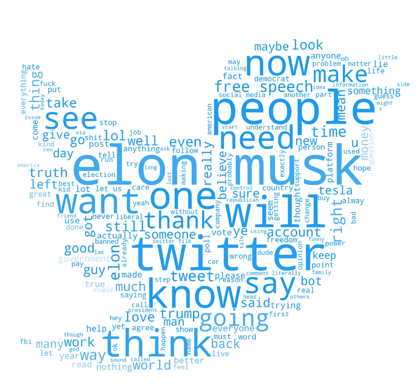

# Data Science Entusiast

## Education
- Integrated M.Tech. (IT) | Grade Point: 8.05 | IIIT Gwalior, MP (_2019 - 2024_)
- HSC (Class 12th) | Percentage: 92.6% | JVPS Muzaffarnagar, UP (_2019_)
- SSC (Class 10th) | Grade Point: 9.8 | HACS Muzaffarnagar, UP (_2017_)

## Projects
**Twitter Sentiment Analysis | B.Tech Summer Project**
- Successfully led and completed a sentiment analysis project on a dataset of 11,000 real-world tweets related to COVID-19 vaccination.
- Engineered a comprehensive Python-based pipeline utilizing NLTK, scikit-learn, and Pandas for seamless data preprocessing, feature extraction, and sentiment analysis.
- Executed rigorous data cleaning and preprocessing tasks, including tokenization, stop-word removal, and stemming, enhancing the accuracy of sentiment analysis results.
- Conducted thorough evaluation of classification models using diverse metrics for sentiment analysis, implementing hyperparameter tuning to optimize model performance and achieve superior results.

**Movies Recommendation System | Academic Project**
- Developed a content-based movie recommender system as part of the curriculum project.
- Leveraged Python and popular libraries such as Pandas, NumPy, and scikit-learn for data preprocessing, feature extraction, and similarity calculations.
- Gathered and preprocessed a comprehensive dataset of movie attributes including titles, genres, etc.
- Utilized cosine similarity to measure the similarity between movies based on their feature vectors, allowing for personalized movie recommendations based on user preferences and content similarity.

**Diwali Sales Analysis | Personal Project**
- Performed data cleaning and data manipulation.
- Performed Exploratory Data Analysis (EDA) using Pandas, NumPy, Matplotlib, Seaborn libraries.
- Identified potential customers across different states, occupation, gender and age groups.
- Identified most selling product categories and the products that can help to plan inventory and hence meet the demands.

## Certifications
- Data Science Math Skills | Duke University 
[Certificate](https://drive.google.com/file/d/1h1LARgwwpVu8qicLJgqKoK_2Xgd5UakD/view?usp=sharing)
- Introduction to Statistics | Stanford University
[Certificate](https://www.coursera.org/account/accomplishments/verify/XPC8NBZ6J3VQ)
- Machine Learning ITIT-4103 | IIIT Gwalior
- Data Mining ITIT-4104 | IIIT Gwalior

## Technical Skills
- Languages: Python, SQL, C/C++
- Libraries & Frameworks: NumPy, Pandas, Vaex, Matplotlib, Seaborn, Scikit-learn, NLTK, TensorFlow, Keras, MERN, jQuery, Bootstrap
- Math & Machine Learning: Calculus, Probability & Statistics, KNN, Naive Bayes, Decision Trees, Random Forest, NLP, DNN, CNN
- Tools & Technologies: Jupyter Notebook, PowerBI, Tableau, MySQL Server, MS Excel, Firebase, Postman, Git, Google Cloud Platform

## Achievements
- Salesforce 2023: Completed Salesforce Administrator Virtual Internship
- LiFT Scholar 2022: Among 500 recipients of Linux Foundation Training Scholarship Program, selected globally
- Flipkart GRiD 4.0: Qualified for the pre-final round out of 58k+ teams
- Innovative India Coding Championship 2022: Secured AIR 1059 in round 1
- Publicis Sapient Jumpstart: Qualified for Jumpstart 2022 out of 30k participants
- Google Hashcode 2022: Achieved Global Rank 2356
- BHU Mathematics Honours Exam 2019: Secured AIR (girls) 3
- UPSEE 2019: Secured AIR (girls) 5

## Position of Responsibility
- Event Management Head | Uthaan: Journalism and Recreational Club | IIIT Gwalior (_August 2020 – Present_)
- Head Of Operations | Rotaract Club of Youth | IIIT Gwalior (_August 2021 – May 2022_)
- Social Media Manager | Aashman Foundation | Remote (_July 2021 – October 2021_)
- Volunteer | Aurora’20 - Cultural Fest | IIIT Gwalior (_November 2019 – February 2020_)
